# 学习记录

Flutter入门学习的案例教程
## 2023年1月5号
```dart
import 'package:flutter/material.dart';
void main(){
  runApp(MaterialApp(
    home: Scaffold(
      appBar: AppBar(title: const Text("你好 flutter"),),
      body: const MyApp()
    ),
  ));
}
/*class MyApp extends StatelessWidget {
  const MyApp({Key? key}) : super(key: key);

  @override
  Widget build(BuildContext context) {
    // TODO: implement build
return const Center(
  child: Text("Hello flutter",textDirection: TextDirection.ltr,
    style:TextStyle(
        color: Colors.blueAccent,
        // backgroundColor: Colors.amberAccent,
        fontSize: 40
    ) ,
  ),
);

  }
}*/
class MyApp extends StatelessWidget {
  const MyApp({Key? key}) : super(key: key);

  @override
  Widget build(BuildContext context) {
    return const Center(
      child: Text("Hello flutter",textDirection: TextDirection.ltr,
        style:TextStyle(
            color: Colors.blueAccent,
            // backgroundColor: Colors.amberAccent,
            fontSize: 40
        ) ,
      ),
    );
  }
}
```
## 2023年1月6号
```dart
import 'package:flutter/material.dart';
void main(){
  runApp(
    MaterialApp(
      home: Scaffold(
        appBar: AppBar(title:const Text("你好，Flutter")),
        body:  Column(
        children: const [
           MyApp(),
          MyButton(),
          MyText(),
        ],
        )
        ),
      ),


  );
}
class MyApp extends StatelessWidget {
  const MyApp({Key? key}) : super(key: key);

  @override
  Widget build(BuildContext context) {
    return  Center(
        child: Container(
          alignment: Alignment.center,//该部分是用来确定当前的文本格式的存放位置的
          margin:const  EdgeInsets.all(40),
          width: 200,
          height: 200,
          decoration:  BoxDecoration(
            color: Colors.blueAccent,
            border: Border.all(//设置边框用的一个数据值操作
              color: Colors.black,
              width: 6
            ),
              borderRadius: BorderRadius.circular(30),//配置圆角的边框矩形程度,同时如果是在设置值为100的情况下，会被设置为圆
              boxShadow:const  [//配置阴影效果
                BoxShadow(
                  color: Colors.black26,
                  blurRadius: 20,

                )
              ],
            gradient:const LinearGradient(
              colors: [Colors.deepOrange,Colors.yellowAccent]
            )
          ),

            child: const Text(
            "Hello Flutter",
              style: TextStyle(
                fontSize: 20,
                color: Colors.blueAccent
              ),
        ),
        )
    );
  }
}
/*
 *
 * 实现出一个对应按钮功能
 */
class MyButton extends StatelessWidget {

  const MyButton({Key? key}) : super(key: key);

  @override
  Widget build(BuildContext context) {
    return  Container(
      alignment: Alignment.center,
      width: 200,
      height: 40,
      margin: const EdgeInsets.all(30),//外边距
      // margin:const EdgeInsets.fromLTRB(1, 2, 4, 6),
      decoration:  BoxDecoration(
        color: Colors.blueAccent,
        borderRadius: BorderRadius.circular(20),
      ),
      child: const Text(
        "Bottom",
        style: TextStyle(
        fontSize: 20,
        color: Colors.white,
      ),
      ),

    );
  }
}
class MyText extends StatelessWidget {
  const MyText({Key? key}) : super(key: key);

  @override
  Widget build(BuildContext context) {
    return  Container(
      width: 200,
      height: 200,
      decoration: const BoxDecoration(
        color: Colors.green
      ),
      child: const Text("文字文字文字文字文字文字文字文字文字文字文字文字",
        style: TextStyle(
          color: Colors.red,
          fontWeight: FontWeight.w900,
          fontSize: 20
        ),
        maxLines: 1,
        overflow: TextOverflow.ellipsis,
      ),
    );
  }
}

```
- 显示图标的代码内容
```dart
class MyHomePage extends StatelessWidget {
  const MyHomePage({Key? key}) : super(key: key);

  @override
  Widget build(BuildContext context) {
    return ListView(
      children: const [
        SizedBox(
          height: 60,
        ),
        Icon(
          Icons.account_circle,
          color: Colors.red,
          size: 100,
        ),
        SizedBox(
          height: 60,
        ),
        Icon(
          FontIcons.alipay,
          size: 100,
          color: Colors.blue,
        ),
        SizedBox(height: 60),
        Icon(FontIcons.instagram, size: 100, color: Colors.pink),
        SizedBox(
          height: 60,
        ),
        Icon(
          FontIcons.wechat,
          color: Colors.green,
          size: 100,
        ),
        SizedBox(
          height: 60,
        ),
        Icon(
          FontIcons.paypal,
          color: Colors.red,
          size: 100,
        ),
        SizedBox(
          height: 60,
        ),
        Icon(
          FontIcons.google,
          color: Colors.orange,
          size: 100,
        )
        // Icon(Icons.add_circle)
      ],
    );
  }
}
```
- 列表代码内容
```dart
 ListTile(
          leading: Icon(FontIcons.google,color: Colors.orange,),
          title: Text(
            "Google corporation",
            style: TextStyle(
              fontSize: 20,
              fontWeight: FontWeight.bold
            ),
          ),

        ),
        Divider(color: Colors.blue,),
        ListTile(
          title: Text(
            "一个列表的组件",
            style: TextStyle(fontSize: 40, fontWeight: FontWeight.bold),
          ),
        ),
        Divider(color: Colors.blue,),
        ListTile(
          title: Text(
            "一个列表的组件",
            style: TextStyle(fontSize: 40, fontWeight: FontWeight.bold),
          ),
        ),
        Divider(color: Colors.blue,thickness: 6,),
        ListTile(
          title: Text(
            "一个列表的组件",
            style: TextStyle(fontSize: 40, fontWeight: FontWeight.bold),
          ),
        ),
        Divider(color: Colors.blue,),
        ListTile(
          title: Text(
            "一个列表的组件",
            style: TextStyle(fontSize: 40, fontWeight: FontWeight.bold),
          ),
        ),
        Divider(color: Colors.blue,),
        ListTile(
          title: Text(
            "一个列表的组件",
            style: TextStyle(fontSize: 40, fontWeight: FontWeight.bold),
          ),
        ),
        Divider(color: Colors.blue,),
        ListTile(
          title: Text(
            "一个列表的组件",
            style: TextStyle(fontSize: 40, fontWeight: FontWeight.bold),
          ),
        ),
        Divider(color: Colors.blue,),
        ListTile(
          title: Text(
            "一个列表的组件",
            style: TextStyle(fontSize: 40, fontWeight: FontWeight.bold),
          ),
        ),
        Divider(color: Colors.blue,),
        ListTile(
          title: Text(
            "一个列表的组件",
            style: TextStyle(fontSize: 40, fontWeight: FontWeight.bold),
          ),
        ),
        Divider(color: Colors.blue,),
        ListTile(
          title: Text(
            "一个列表的组件",
            style: TextStyle(fontSize: 40, fontWeight: FontWeight.bold),
          ),
        ),
        Divider(color: Colors.blue,),
        ListTile(
          title: Text(
            "一个列表的组件",
            style: TextStyle(fontSize: 40, fontWeight: FontWeight.bold),
          ),
        ),
        Divider(color: Colors.blue,),
        ListTile(
          title: Text(
            "一个列表的组件",
            style: TextStyle(fontSize: 40, fontWeight: FontWeight.bold),
          ),
        ),
```
- 个人中心类似组件 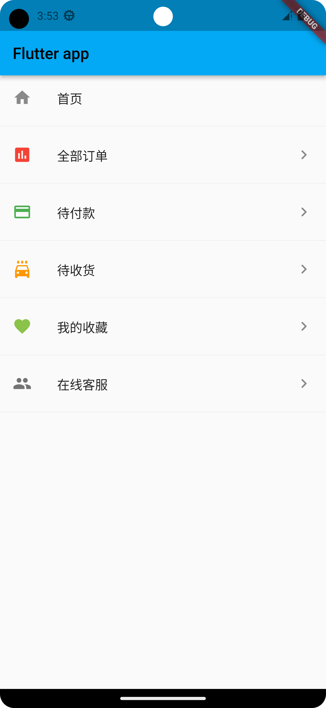
```dart
 return ListView(
      children: const <Widget>[
    ListTile(
        leading: Icon(Icons.home),
        title: Text("首页"),
    ),
        Divider(),
        ListTile(
          leading: Icon(Icons.assessment,color: Colors.red,),
          title: Text("全部订单"),
          trailing: Icon(Icons.keyboard_arrow_right_rounded),

        ),
        Divider(),
        ListTile(
          leading: Icon(Icons.payment,color: Colors.green,),
          title: Text("待付款"),
          trailing: Icon(Icons.keyboard_arrow_right_rounded),
        ),


        Divider(),
        ListTile(
          leading: Icon(Icons.local_car_wash,color: Colors.orange,),
          title: Text("待收货"),
          trailing: Icon(Icons.keyboard_arrow_right_rounded),

        ),
        Divider(),
        ListTile(
          leading: Icon(Icons.favorite,color: Colors.lightGreen,),
          title: Text("我的收藏"),
          trailing: Icon(Icons.keyboard_arrow_right_rounded),

        ),
        Divider(),
        ListTile(
          leading: Icon(Icons.people,color: Colors.black54,),
          title: Text("在线客服"),
          trailing: Icon(Icons.keyboard_arrow_right_rounded),
        ),
        Divider(),
      ],
      
    );
```
## 2023年1月7号
- 动态生成列表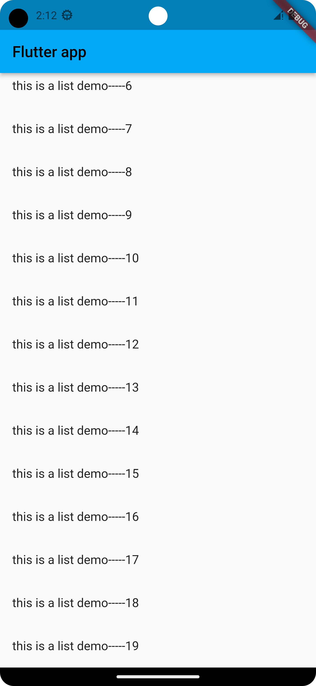
```dart
List<Widget> _initListData(){
    List<Widget> list =[];
    for(int i=0 ; i<20;i++){
      list.add(
        ListTile(
          title: Text("this is a list demo-----${i}"),
        )
      );
    }
    return list;
  }
```
- 使用两种放过是去实现出动态列表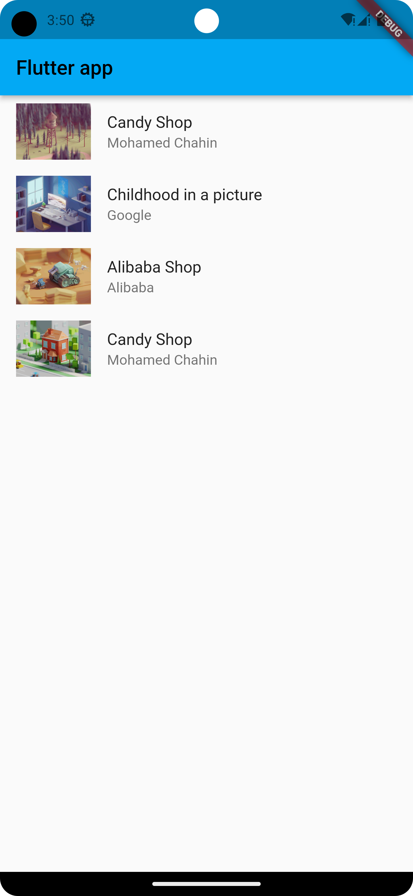
```dart
// 第一种方式 使用遍历的方式去做
/*List<Widget> _initListData(){
  List<Widget> tempList =[];
  for(int i = 0;i<listData.length;i++){
    tempList.add(
      ListTile(
        leading: Image.network("${listData[i]["imageUrl"]}"),
        title: Text("${listData[i]["title"]}"),
        subtitle:Text("${listData[i]["author"]}") ,
      )
    );
  }
  return tempList;
}*/
  //第二种方式使用map的方式去处理
  List<Widget> _initListData(){
    var tempList=listData.map((value){
      return ListTile(
        leading: Image.network("${value["imageUrl"]}"),
        title: Text("${value["title"]}"),
        subtitle: Text("${value["author"]}"),

      );

    });

    return tempList.toList();
  }

```
- 使用<code>bulider</code>函数去实现对应的数据内容信息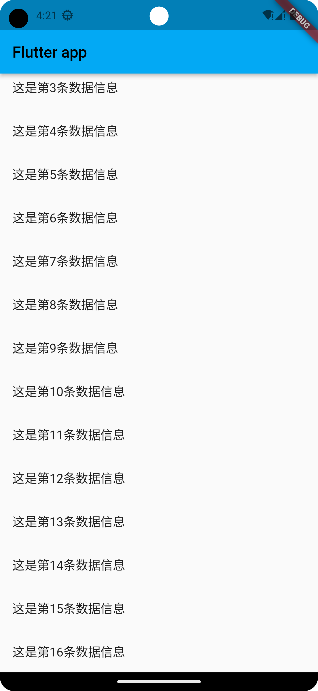
```dart
 List<String> list = [];

  MyHomePage({Key? key}) : super(key: key){
    {
      for(int i =0 ;i<20;i++){
        list.add("这是第${i}条数据信息");
      }
    }
  }
  @override
  Widget build(BuildContext context) {

return  ListView.builder(
  itemCount: list.length-3,
  itemBuilder: (context,index){
    return ListTile(
      title: Text(list[index]),
    );
  },
);
  }
```
- 使用到全新的<code>builder</code>构建相似的内容布局
```dart
class MyHomePage extends StatelessWidget {

  const MyHomePage({Key? key}) : super(key: key);
  @override
  Widget build(BuildContext context) {

return  ListView.builder(
  itemCount: listData.length,
  itemBuilder: (context,index){
    return ListTile(
      leading: Image.network("${listData[index]["imageUrl"]}"),
      title: Text("${listData[index]["title"]}"),
      subtitle: Text("${listData[index]["author"]}"),
    );
  },
);
  }
}
```
- 使用<code>GridView</code>组件信息，去构建出一个网格式的组件信息内容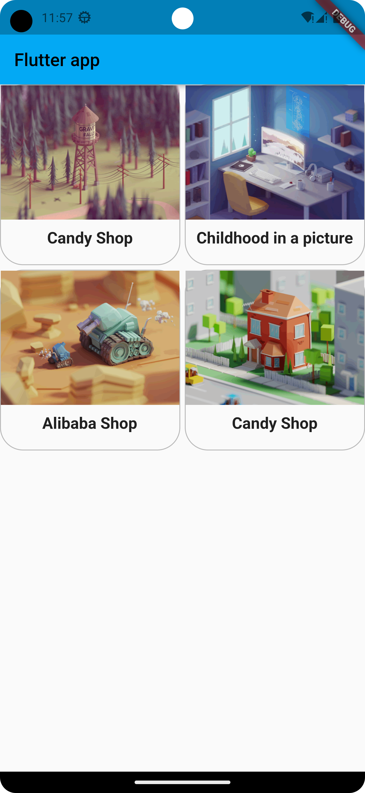
```dart
List<Widget> _initGridView(){
 // 显示出对称的组件信息
 /* List<Widget> tempList = [];
  for(int i =0 ; i< 20 ; i++){
    tempList.add(
      Container(
        alignment: Alignment.center,
        decoration:const BoxDecoration(
          color: Colors.greenAccent,
        ),
        child: Text("第$i个组件内容信息",
        style: const TextStyle(color: Colors.black54,
        fontSize: 30,
        fontWeight: FontWeight.bold,
        ),),
      )
    );
  }
  return tempList;*/
  var tempList = listData.map((value){
    return Container(
      // height: 200,
      decoration: BoxDecoration(
        borderRadius: BorderRadius.circular(26),
        border: Border.all(color: Colors.black26)

      ),
      child: Column(
        children: [
          Image.network("${value["imageUrl"]}"),
          const SizedBox(height: 10,),
          Text("${value["title"]}",style: const TextStyle(
            fontSize: 18,
            fontWeight: FontWeight.bold,
          ),),
        ],


      ),
    );
  });
  return tempList.toList();
}
```
- 实现组件使用拆分的方式
```dart
import 'package:flutter/material.dart';
import 'res/Fonts.dart';
import './res/listData.dart';
void main() {
  runApp(const MyApp());
}

class MyApp extends StatelessWidget {
  const MyApp({super.key});

  @override
  Widget build(BuildContext context) {
    // final wordPair = WordPair.random();
    return MaterialApp(
      theme: ThemeData(
        primarySwatch: Colors.lightBlue,
      ),
      home: Scaffold(
        appBar: AppBar(
          title: const Text("Flutter app"),
        ),
        body: const MyHomePage(),
      ),
    );
  }
}

class MyHomePage extends StatelessWidget {

  const MyHomePage({Key? key}) : super(key: key);
  @override
  Widget build(BuildContext context) {

return  GridView.builder(
  itemCount: listData.length,
  gridDelegate: const SliverGridDelegateWithFixedCrossAxisCount(
    crossAxisCount: 2,//一行显示的网格的数量
    crossAxisSpacing: 5,
    mainAxisSpacing: 5,
    childAspectRatio: 1,
  ),
  itemBuilder: _initGridData,

);

  }
}
Widget _initGridData(context,index){
  return Container(
decoration: BoxDecoration(
borderRadius: BorderRadius.circular(10),
border:Border.all(
  color: Colors.black26,
)
),
  child: Column(
    children: [
      Image.network("${listData[index]["imageUrl"]}"),
      const SizedBox(height: 10,),
      Text("${listData[index]["title"]}",style: const TextStyle(
        fontSize: 18,
        fontWeight: FontWeight.bold
      ),)
    ],
  ),
  );
}


// 2023-1-7//////////////////////////////////////
/*List<Widget> _initGridView(){
 // 显示出对称的组件信息
 *//* List<Widget> tempList = [];
  for(int i =0 ; i< 20 ; i++){
    tempList.add(
      Container(
        alignment: Alignment.center,
        decoration:const BoxDecoration(
          color: Colors.greenAccent,
        ),
        child: Text("第$i个组件内容信息",
        style: const TextStyle(color: Colors.black54,
        fontSize: 30,
        fontWeight: FontWeight.bold,
        ),),
      )
    );
  }
  return tempList;*//*
  *//*var tempList = listData.map((value){
    return Container(
      // height: 200,
      decoration: BoxDecoration(
        borderRadius: BorderRadius.circular(26),
        border: Border.all(color: Colors.black26)

      ),
      child: Column(
        children: [
          Image.network("${value["imageUrl"]}"),
          const SizedBox(height: 10,),
          Text("${value["title"]}",style: const TextStyle(
            fontSize: 18,
            fontWeight: FontWeight.bold,
          ),),
        ],


      ),
    );
  });
  return tempList.toList();*//*
}*/

```
## 2023年1月8号
- 实现出卡片式的不同样式代码
```dart
import 'package:flutter/material.dart';
import 'res/Fonts.dart';
import './res/listData.dart';
void main() {
  runApp(const MyApp());
}

class MyApp extends StatelessWidget {
  const MyApp({super.key});

  @override
  Widget build(BuildContext context) {
    // final wordPair = WordPair.random();
    return MaterialApp(
      theme: ThemeData(
        primarySwatch: Colors.lightBlue,
      ),
      home: Scaffold(
        appBar: AppBar(
          title: const Text("Flutter app"),
        ),
        body: const MyHomePage(),
      ),
    );
  }
}

class MyHomePage extends StatelessWidget {

  const MyHomePage({Key? key}) : super(key: key);
  @override
  Widget build(BuildContext context) {
    return Container(
      width: double.infinity,
      height: double.infinity,
      color: Colors.greenAccent,
      child:  Row(//如果是在这个地方设置为Flex，在设置出一个direction属性值的时候就会出现有vertical，此时其特征类似于row
        mainAxisAlignment: MainAxisAlignment.center,

        children: [

          Expanded(flex: 1,child: IconContainer(Icons.ac_unit,color: Colors.white38,),
          ),
          Expanded(flex: 2,child: IconContainer(Icons.account_balance_wallet,color: Colors.indigo,),),
          Expanded(flex: 3,child:  IconContainer(Icons.add_a_photo_rounded,color: Colors.green,))

        ],
      ),
    );


  }
}
class IconContainer extends StatelessWidget {
  Color color;
  IconData icon;
  IconContainer(this.icon,{Key? key,this.color=Colors.red}) : super(key: key);

  @override
  Widget build(BuildContext context) {
    return  Container(
      color: color,
      height: 120,
      width: 120,
      child:  Icon(icon,color: Colors.deepOrange,size: 60,),
    );;
  }
}
```
- 嵌套组件信息处理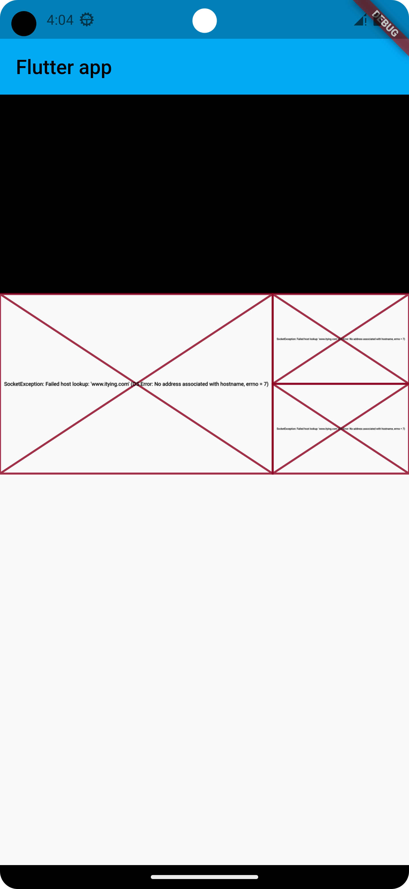
```dart
import 'package:flutter/material.dart';
import 'res/Fonts.dart';
import './res/listData.dart';

void main() {
  runApp(const MyApp());
}

class MyApp extends StatelessWidget {
  const MyApp({super.key});

  @override
  Widget build(BuildContext context) {
    // final wordPair = WordPair.random();
    return MaterialApp(
      theme: ThemeData(
        primarySwatch: Colors.lightBlue,
      ),
      home: Scaffold(
        appBar: AppBar(
          title: const Text("Flutter app"),
        ),
        body: const MyHomePage(),
      ),
    );
  }
}

class MyHomePage extends StatelessWidget {
  const MyHomePage({Key? key}) : super(key: key);
  @override
  Widget build(BuildContext context) {
    return ListView(
      children: [
        Container(
          width: double.infinity,
          height: 200,
          color: Colors.black,
        ),
        Row(
          children: [
            Expanded(
              flex: 2,
              child: SizedBox(
                height: 180,
                child: Image.network(
                  "https://www.itying.com/images/flutter/1.png",
                  fit: BoxFit.cover,
                ),
              ),
            ),
            Expanded(
              flex: 1,
              child: SizedBox(
                height: 180,
                child: Column(
                  children: [
                    Expanded(
                      flex: 1,
                      child: Image.network(
                        "https://www.itying.com/images/flutter/1.png",
                        fit: BoxFit.cover,),
                    ),
                    Expanded(
                      flex: 1,
                      child: Image.network(
                        "https://www.itying.com/images/flutter/0.png",
                        fit: BoxFit.cover,),
                    ),
                  ],
                ),
              )
            )
          ],
        )
      ],
    );
  }
}

```
## 2023年1月9号
- 实现浮动定位的第一个例子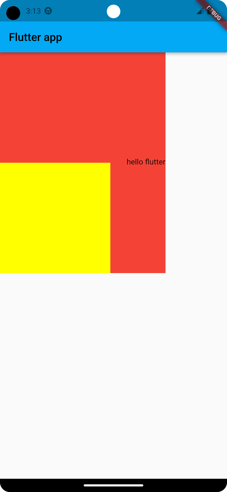
```dart
Container(

        height: 400,
        width: 300,
        color: Colors.red,
      child: Stack( //相对于外部的容器进行定位，如果没有外部容器就相对于整个屏幕定位
      children: [
        Positioned(
          left: 0,
          bottom: 0,
          child: Container(
          height: 200,
          width: 200,
          color: Colors.yellowAccent,
        ),),
       const Positioned(
         right: 0,
         top: 190,
         child:  Text(" hello flutter"),
       )

      ],
    ),);
```
- 构建二级菜单导航栏目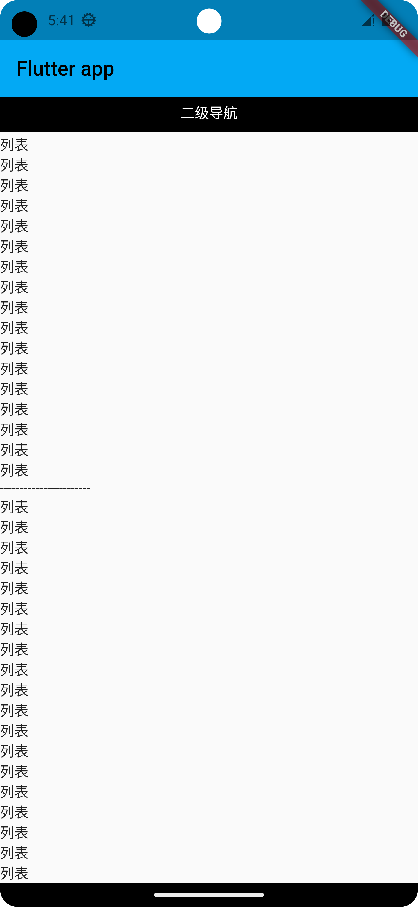
```dart
import 'package:flutter/material.dart';
import 'res/Fonts.dart';
import './res/listData.dart';

void main() {
  runApp(const MyApp());
}

class MyApp extends StatelessWidget {
  const MyApp({super.key});

  @override
  Widget build(BuildContext context) {

    // final wordPair = WordPair.random();
    return MaterialApp(
      theme: ThemeData(
        primarySwatch: Colors.lightBlue,
      ),
      home: Scaffold(
        appBar: AppBar(
          title: const Text("Flutter app"),
        ),
        body: const MyHomePage(),
      ),
    );
  }
}

class MyHomePage extends StatelessWidget {
  const MyHomePage({Key? key}) : super(key: key);
  @override
  Widget build(BuildContext context) {
    final size = MediaQuery.of(context).size;
    return Stack(
      children: [
        ListView(
          padding: const EdgeInsets.only(top: 50),
          children: const [
            Text("列表1"),
            Text("列表2"),
            Text("列表"),
            Text("列表"),
            Text("列表"),
            Text("列表"),
            Text("列表"),
            Text("列表"),
            Text("列表"),
            Text("列表"),
            Text("列表"),
            Text("列表"),
            Text("列表"),
            Text("列表"),
            Text("列表"),
            Text("列表"),
            Text("列表"),
            Text("列表"),
            Text("列表"),
            Text("列表"),
            Text("列表"),
            Text("列表"),
            Text("列表"),
            Text("列表"),
            Text("列表"),
            Text("列表"),
            Text("-----------------------"),
            Text("列表"),
            Text("列表"),
            Text("列表"),
            Text("列表"),
            Text("列表"),
            Text("列表"),
            Text("列表"),
            Text("列表"),
            Text("列表"),
            Text("列表"),
            Text("列表"),
            Text("列表"),
            Text("列表"),
            Text("列表"),
            Text("列表"),
            Text("列表"),
            Text("列表"),
            Text("列表"),
            Text("列表"),
            Text("-----------------------"),
            Text("列表"),
            Text("列表"),
            Text("列表"),
            Text("列表"),
            Text("列表"),
            Text("列表"),
            Text("列表"),
            Text("列表"),
            Text("列表"),
            Text("列表"),
            Text("列表"),
            Text("列表"),
            Text("列表"),
            Text("列表"),
            Text("列表"),
            Text("列表"),
            Text("列表"),
            Text("列表"),
            Text("列表"),
          ],
        ),
      Positioned(
        // width: 300,//此时对于width何height都是只能拥有固定值，如果想要去获取当前屏幕的一个具体宽度就是需要去通过build方法中去获得
        width: size.width,
        height: 50,
        left: 0,
        top: -10,
        child:
            Row(
              children: [
                Expanded(flex: 1,

                child: Container(
                  alignment: Alignment.center,
                  height: 40,
                  color: Colors.black,
                  child: const Text("二级导航",style: TextStyle(
                    color: Colors.white
                  ),),
                ),

                )
              ],
               )

      )
      ],
    );
  }
}

```
- 使用card组件实现部分功能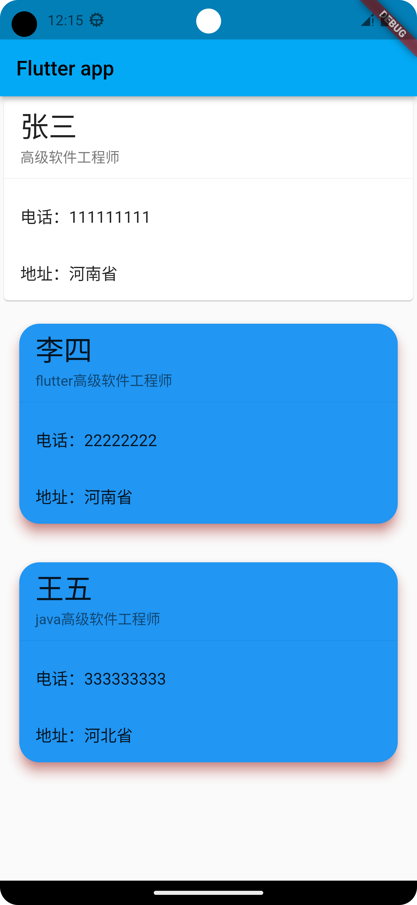
```dart
import 'package:flutter/material.dart';
import 'res/Fonts.dart';
import './res/listData.dart';

void main() {
  runApp(const MyApp());
}

class MyApp extends StatelessWidget {
  const MyApp({super.key});

  @override
  Widget build(BuildContext context) {

    // final wordPair = WordPair.random();
    return MaterialApp(
      theme: ThemeData(
        primarySwatch: Colors.lightBlue,
      ),
      home: Scaffold(
        appBar: AppBar(
          title: const Text("Flutter app"),
        ),
        body: const MyHomePage(),
      ),
    );
  }
}

class MyHomePage extends StatelessWidget {
  const MyHomePage({Key? key}) : super(key: key);
  @override
  Widget build(BuildContext context) {
    final size = MediaQuery.of(context).size;
    return ListView(
      children: [
        Card(
          child: Column(
            children: const [

            ListTile(
              title: Text("张三",style: TextStyle(fontSize: 28),),
              subtitle: Text("高级软件工程师"),
            ),
              Divider(),
              ListTile(
                title: Text("电话：111111111"),
              ),
              ListTile(
                title: Text("地址：河南省"),
              )

            ],
          ),
        ),
        Card(
          shape: RoundedRectangleBorder(
            borderRadius: BorderRadius.circular(20),
          ),
          margin:const EdgeInsets.all(19),
          color: Colors.blue,
          elevation:10 ,
          shadowColor: Colors.red,
          child: Column(
            children: const [

              ListTile(
                title: Text("李四",style: TextStyle(fontSize: 28),),
                subtitle: Text("flutter高级软件工程师"),
              ),
              Divider(),
              ListTile(
                title: Text("电话：22222222"),
              ),
              ListTile(
                title: Text("地址：河南省"),
              )

            ],
          ),
        ),
        Card(
          shape: RoundedRectangleBorder(
            borderRadius: BorderRadius.circular(20),
          ),
          margin:const EdgeInsets.all(19),
          color: Colors.blue,
          elevation:10 ,
          shadowColor: Colors.red,
          child: Column(
            children: const [

              ListTile(
                title: Text("王五",style: TextStyle(fontSize: 28),),
                subtitle: Text("java高级软件工程师"),
              ),
              Divider(),
              ListTile(
                title: Text("电话：333333333"),
              ),
              ListTile(
                title: Text("地址：河北省"),
              )

            ],
          ),
        )
      ],
    );
  }
}

```
- 实现出卡片式的圆形小布局
```dart
class MyHomePage extends StatelessWidget {
  const MyHomePage({Key? key}) : super(key: key);
  @override
  Widget build(BuildContext context) {
    final size = MediaQuery.of(context).size;
    return ListView(
      children: [
        Card(
          margin:const EdgeInsets.all(10),
          shadowColor: Colors.blue,
          elevation: 10,
          color: Colors.white38,
          shape: RoundedRectangleBorder(
              borderRadius: BorderRadius.circular(10)
          ),
          child: Column(children: [
            AspectRatio(
              aspectRatio: 16 / 9,
              child: Image.network(
                "https://www.itying.com/images/flutter/4.png",
                fit: BoxFit.cover,
              ),
            ),
            ListTile(
              leading: ClipOval(

                child: Image.network(
                  "https://www.itying.com/images/flutter/4.png",
                  fit: BoxFit.cover,
                  height: 40,
                  width: 40,
                ),

              ),
              title:const  Text("标题"),
              subtitle:const Text("************"),
            )
          ]),
        ),
        Card(
          margin:const EdgeInsets.all(10),
          shadowColor: Colors.blue,
          elevation: 10,
          color: Colors.white38,
          shape: RoundedRectangleBorder(
              borderRadius: BorderRadius.circular(10)
          ),
          child: Column(children: [
            AspectRatio(
              aspectRatio: 16 / 9,
              child: Image.network(
                "https://www.itying.com/images/flutter/4.png",
                fit: BoxFit.cover,
              ),
            ),
            const ListTile(
              leading: CircleAvatar(
                backgroundImage: NetworkImage("https://www.itying.com/images/flutter/2.png"),
                radius: 20,

              ),
              title:Text("标题"),
              subtitle:Text("************"),
            )
          ]),
        ),

      ],
    );
  }
}

```
## 2023年1月10号

- 按钮图样的实现代码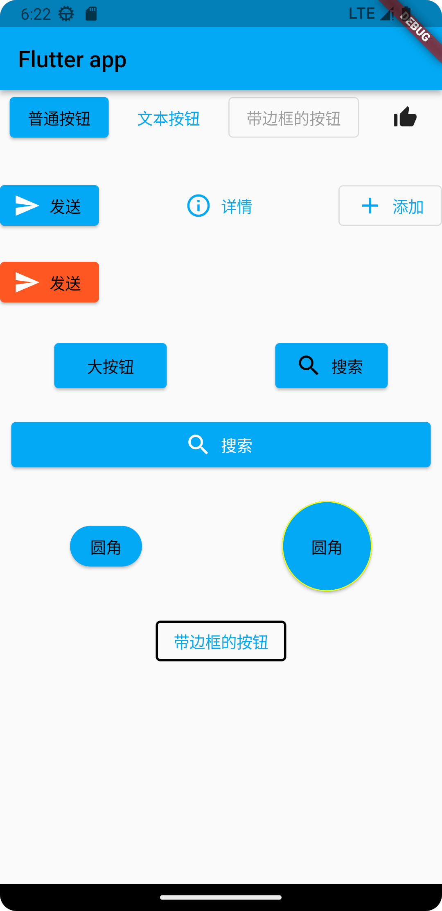

```dart
  import 'package:flutter/material.dart';
  import 'res/Fonts.dart';
  import './res/listData.dart';
  
  void main() {
    runApp(const MyApp());
  }
  
  class MyApp extends StatelessWidget {
    const MyApp({super.key});
  
    @override
    Widget build(BuildContext context) {
      // final wordPair = WordPair.random();
      return MaterialApp(
        theme: ThemeData(
          primarySwatch: Colors.lightBlue,
        ),
        home: Scaffold(
          appBar: AppBar(
            title: const Text("Flutter app"),
          ),
          body: const MyHomePage(),
        ),
      );
    }
  }
  
  class MyHomePage extends StatelessWidget {
    const MyHomePage({Key? key}) : super(key: key);
  
    @override
    Widget build(BuildContext context) {
      final size = MediaQuery.of(context).size;
      return ListView(
        children: [
          Row(
            mainAxisAlignment: MainAxisAlignment.spaceAround,
            children: [
              ElevatedButton(
                  onPressed: () {
                    print("普通按钮");
                  },
                  child: const Text("普通按钮")),
              TextButton(onPressed: () {}, child: const Text("文本按钮")),
              const OutlinedButton(onPressed: null, child: Text("带边框的按钮")),
              IconButton(onPressed: () {}, icon: const Icon(Icons.thumb_up_alt))
            ],
          ),
          const SizedBox(
            height: 30,
          ),
          Row(
            mainAxisAlignment: MainAxisAlignment.spaceBetween,
            children: [
              ElevatedButton.icon(
                  onPressed: () {},
                  icon: const Icon(
                    Icons.send,
                    color: Colors.white,
                  ),
                  label: const Text("发送")),
              TextButton.icon(
                  onPressed: () {},
                  icon: const Icon(Icons.info_outline),
                  label: const Text("详情"),
              ),
              OutlinedButton.icon(
                  onPressed: () {},
                  icon: const Icon(Icons.add),
                  label: const Text("添加")),
  
            ],
          ),
          const SizedBox(height: 20,),
          Row(
            children: [
              ElevatedButton.icon(
                  style: ButtonStyle(
                    backgroundColor: MaterialStateProperty.all(Colors.deepOrange),
                  ),
                  onPressed: () {},
                  icon: const Icon(
                    Icons.send,
                    color: Colors.white,
                  ),
                  label: const Text("发送")),
            ],
          ),
          const SizedBox(height: 30,),
          Row(
            mainAxisAlignment: MainAxisAlignment.spaceAround,
            children: [
              Container(
                height: 40,
                width: 100,
                child:ElevatedButton(
                  onPressed: (){},
                  child: const Text("大按钮"),
                ),
              ),
              Container(
                height: 40,
                width: 100,
                child: ElevatedButton.icon(onPressed: (){}, icon: const Icon(Icons.search), label: const Text("搜索")),
              )
            ],
          ),
          const SizedBox(height: 20,),
          Row(
            children: [
              Expanded(
                flex: 1,
                  child:  SizedBox(
                child:
                  Container(
                    margin:const EdgeInsets.all(10),
                    height: 40,
                    child: ElevatedButton.icon(onPressed: (){}, icon: const Icon(Icons.search), label: const Text("搜索"),
                    style: ButtonStyle(
                      foregroundColor: MaterialStateProperty.all(Colors.white)
                    ),),
                  ),
              ))
            ],
          ),
          const SizedBox(height: 20,),
          Row(
            mainAxisAlignment: MainAxisAlignment.spaceAround,
  
            children: [
              ElevatedButton(onPressed:(){},
                style: ButtonStyle(
                  shape: MaterialStateProperty.all(
                    RoundedRectangleBorder(
                      borderRadius: BorderRadius.circular(20)
                    )
                  )
                ),
                child:  const Text("圆角"),
                ),
              SizedBox(
                height: 80,
                width: 80,
                child:ElevatedButton(onPressed:(){},
                  style: ButtonStyle(
                      shape: MaterialStateProperty.all(
                          const CircleBorder(
                              side: BorderSide(
                                color: Colors.yellowAccent,
                              )
                          )
                      )
                  ),
                  child:  const Text("圆角"),
                ) ,
              )
  
            ],
          ),
          const SizedBox(height: 20,),
          Row(
            mainAxisAlignment: MainAxisAlignment.center,
            children: [
              OutlinedButton(onPressed: (){}, child:const Text("带边框的按钮"),
              style:  ButtonStyle(
                side: MaterialStateProperty.all(
                  const BorderSide(
                    width: 2,
                    color: Colors.black,
                  )
                )
              ),),
            ],
          )
        ],
      );
    }
  }
```

- 实现多个搜索记录的实现过程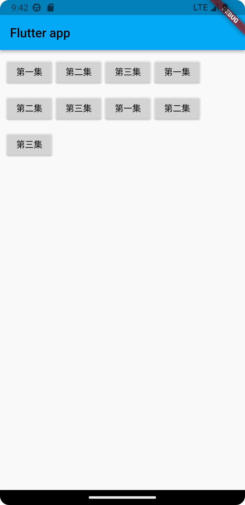

```dart
import 'package:flutter/material.dart';
import 'res/Fonts.dart';
import './res/listData.dart';

void main() {
  runApp(const MyApp());
}

class MyApp extends StatelessWidget {
  const MyApp({super.key});

  @override
  Widget build(BuildContext context) {
    // final wordPair = WordPair.random();
    return MaterialApp(
      theme: ThemeData(
        primarySwatch: Colors.lightBlue,
      ),
      home: Scaffold(
        appBar: AppBar(
          title: const Text("Flutter app"),
        ),
        body: const MyHomePage(),
      ),
    );
  }
}

class MyHomePage extends StatelessWidget {
  const MyHomePage({Key? key}) : super(key: key);

  @override
  Widget build(BuildContext context) {
    return Padding(
      padding: const EdgeInsets.all(10),
      child: Wrap(
        spacing: 5, //水平间距
        runSpacing: 10, //垂直间距
        children: [
          Button(
            "第一集",
            onPressed: () {},
          ),
          Button(
            "第二集",
            onPressed: () {},
          ),
          Button(
            "第三集",
            onPressed: () {},
          ),
          Button(
            "第一集",
            onPressed: () {},
          ),
          Button(
            "第二集",
            onPressed: () {},
          ),
          Button(
            "第三集",
            onPressed: () {},
          ),
          Button(
            "第一集",
            onPressed: () {},
          ),
          Button(
            "第二集",
            onPressed: () {},
          ),
          Button(
            "第三集",
            onPressed: () {},
          ),
        ],
      ),
    );
  }
}

class Button extends StatelessWidget {
  String text; //按钮的文字
  void Function()? onPressed; //点击按钮时候使用到的方法
  Button(this.text, {Key? key, required this.onPressed}) : super(key: key);

  @override
  Widget build(BuildContext context) {
    return ElevatedButton(
        style: ButtonStyle(
            backgroundColor: MaterialStateProperty.all(Colors.white38),
            foregroundColor: MaterialStateProperty.all(Colors.black)),
        onPressed: onPressed,
        child: Text(text));
  }
}
```
- 一个简单的搜索历史记录页面
```dart
import 'package:flutter/material.dart';
import 'res/Fonts.dart';
import './res/listData.dart';

void main() {
  runApp(const MyApp());
}

class MyApp extends StatelessWidget {
  const MyApp({super.key});

  @override
  Widget build(BuildContext context) {
    // final wordPair = WordPair.random();
    return MaterialApp(
      theme: ThemeData(
        primarySwatch: Colors.lightBlue,
      ),
      home: Scaffold(
        appBar: AppBar(
          title: const Text("Flutter app"),
        ),
        body: const MyHomePage(),
      ),
    );
  }
}

class MyHomePage extends StatelessWidget {
  const MyHomePage({Key? key}) : super(key: key);

  @override
  Widget build(BuildContext context) {
    return ListView(
      padding: const EdgeInsets.all(10),
      children: [
        Row(
          children: [
            Text(
              "热搜",
              style: Theme.of(context).textTheme.titleLarge,
            ),
          ],
        ),
        const Divider(),
        Wrap(
          spacing: 10,
          runSpacing: 10,
          children: [
            Button("男装", onPressed: () {}),
            Button("女装", onPressed: () {}),
            Button("手机", onPressed: () {}),
            Button("笔记本", onPressed: () {}),
            Button("玩具", onPressed: () {}),
            Button("时尚", onPressed: () {}),
            Button("电脑", onPressed: () {}),
            Button("平板", onPressed: () {}),
            Button("水杯", onPressed: () {}),
          ],
        ),
        const SizedBox(
          height: 10,
        ),
        Row(
          children: [
            Text(
              "历史记录",
              style: Theme.of(context).textTheme.titleLarge,
            ),
          ],
        ),
        const Divider(),
        Column(
          children: const [
            ListTile(
              title: Text("女装"),
            ),
            Divider(),
            ListTile(
              title: Text("男装"),
            ),
            Divider(),
            ListTile(
              title: Text("笔记本电脑"),
            ),
            Divider(),
          ],
        ),
        const SizedBox(
          height: 40,
        ),
        Padding(
          padding: const EdgeInsets.all(40),
          child: OutlinedButton.icon(
            style:  ButtonStyle(
              foregroundColor: MaterialStateProperty.all(Colors.white),
              backgroundColor: MaterialStateProperty.all(Colors.red),
              shape: MaterialStateProperty.all(
              RoundedRectangleBorder(
              borderRadius: BorderRadius.circular(20)
                )
              )
            ),
              onPressed: () {},
              icon: const Icon(Icons.delete),
              label: const Text("清除历史记录")),
        )
      ],
    );
  }
}

class Button extends StatelessWidget {
  String text; //按钮的文字
  void Function()? onPressed; //点击按钮时候使用到的方法
  Button(this.text, {Key? key, required this.onPressed}) : super(key: key);

  @override
  Widget build(BuildContext context) {
    return ElevatedButton(
        style: ButtonStyle(
            backgroundColor: MaterialStateProperty.all(Colors.white38),
            foregroundColor: MaterialStateProperty.all(Colors.black)),
        onPressed: onPressed,
        child: Text(text));
  }
}
```
- 实现即时的点按操作，使得可以控制按钮的加减
```dart
import 'package:flutter/foundation.dart';
import 'package:flutter/material.dart';
import 'res/Fonts.dart';
import './res/listData.dart';

void main() {
  runApp(const MyApp());
}

class MyApp extends StatelessWidget {
  const MyApp({super.key});

  @override
  Widget build(BuildContext context) {
    // final wordPair = WordPair.random();
    return MaterialApp(
      title: "Flutter demo",
      theme: ThemeData(
        primarySwatch: Colors.lightBlue,
      ),
      home: const HomePage(),
    );
  }
}

class HomePage extends StatefulWidget {
  const HomePage({Key? key}) : super(key: key);

  @override
  State<HomePage> createState() => _HomePageState();
}

class _HomePageState extends State<HomePage> {
  int countNum = 0;
  @override
  Widget build(BuildContext context) {
    if (kDebugMode) {
      print(countNum);
    }
    return Scaffold(
      appBar: AppBar(
        title: const Text("Flutter App"),
      ),
      body: Center(
        child: Column(
          mainAxisAlignment: MainAxisAlignment.center,
          children: [
            Text(
              "$countNum",
              style: const TextStyle(fontWeight: FontWeight.bold, fontSize: 88),
            ),
            const SizedBox(
              height: 40,
            ),
            ElevatedButton(
                onPressed: () {
                  //使用setstate函数的目的是为了可以在每次改变后重新去执行build函数，
                  // 使得屏幕中及时显示出当前的状况
                  setState(() {
                    countNum++;
                  });
                },
                child: Text(
                  "增加",
                  style: Theme.of(context).textTheme.titleLarge,
                ))
          ],
        ),
      ),
      floatingActionButton: FloatingActionButton(
        onPressed: () {
          setState(() {
            countNum++;
          });
        },
        child:const Icon(Icons.add),
      ),
    );
  }
}
```
- 实现点击后出现后出现新的列表
```dart
import 'package:flutter/foundation.dart';
import 'package:flutter/material.dart';
import 'res/Fonts.dart';
import './res/listData.dart';

void main() {
  runApp(const MyApp());
}

class MyApp extends StatelessWidget {
  const MyApp({super.key});

  @override
  Widget build(BuildContext context) {
    // final wordPair = WordPair.random();
    return MaterialApp(
      title: "Flutter demo",
      theme: ThemeData(
        primarySwatch: Colors.lightBlue,
      ),
      home: const HomePage(),
    );
  }
}
class HomePage extends StatefulWidget {
  const HomePage({Key? key}) : super(key: key);

  @override
  State<HomePage> createState() => _HomePageState();
}

class _HomePageState extends State<HomePage> {
  final List<String>_list = [];
  @override
  Widget build(BuildContext context) {
    return Scaffold(
      appBar: AppBar(title:const Text("Flutter App"),),
      body: ListView(
        children:
        _list.map((value){
          return ListTile(
            title: Text(value),
          );
        }).toList(),
      ),
      floatingActionButton: FloatingActionButton(
        onPressed: (){
          setState((){
            _list.add("这是一个列表");
          });
        },
        child:const Icon(Icons.add),
      ),
    );
  }
}
```
